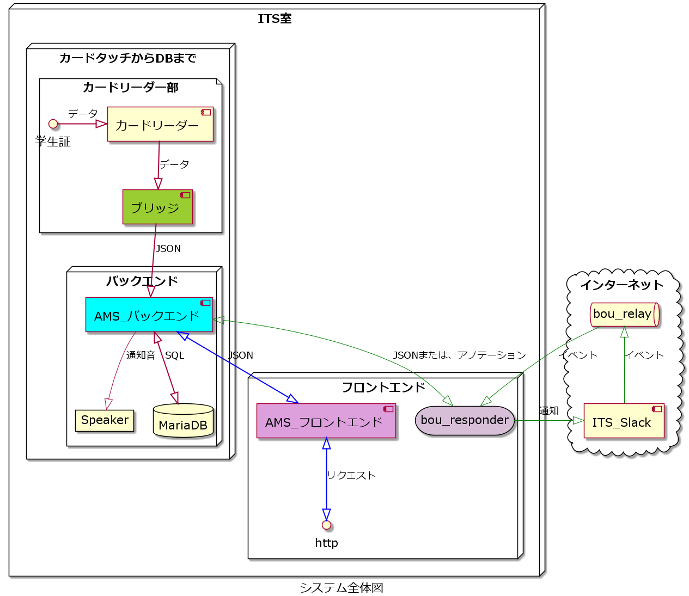

# ams-project

入退室管理システムプロジェクト

## プロジェクトの構成

---

## プロジェクトのリポジトリ一覧

### ブリッジ

[カードリーダー部のブリッジ](https://github.com/su-its/rdr-bridge)

---

## Node.js 使用部

- Node.js ver.14.x
- npm@7

---

### バックエンド部

- TypeScript で記述

[AMS_バックエンド](https://github.com/su-its/ams-backend-nodejs)

---

### フロントエンド部

- フレームワーク: Nuxt.js
- JavaScript で記述

[AMS_フロントエンド](https://github.com/su-its/ams-frontend)

---

### bou_responder

[Slack応対用フロントエンド](https://github.com/su-its/bou-responder)
