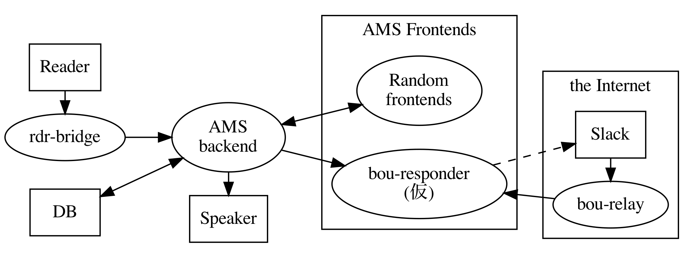

# ams-project

入退室管理システムプロジェクト

## プロジェクトの構成

## プロジェクトのリポジトリ群
https://github.com/su-its/ams-backend-nodejs : バックエンドサーバ  
https://github.com/su-its/rdr-bridge : カードリーダとバックエンド間のブリッジ    
https://github.com/su-its/ams-frontend : 一般ユーザ向けインタフェースを提供するフロントエンド  
https://github.com/su-its/bou-responder : Slack応対用フロントエンド
